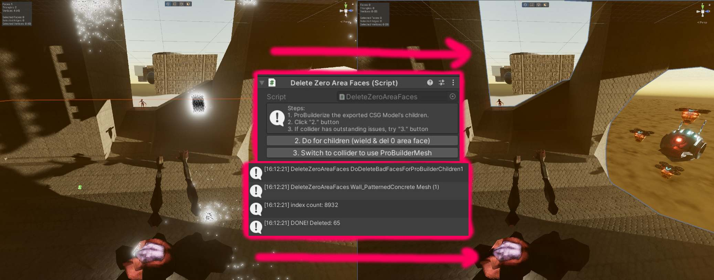

# Delete0AreaFaces

Script for Unity ProBuilder + RealtimeCSG mapping that deletes faces with 0 area (containing NaN tangent coords). 
- RealtimeCSG writes NaN to tangent coord space of mesh, causing shaders using normal maps + directional lightmap to spread NaNs everywhere.
- All these faces NaN faces have an area of zero, so this script walks through all faces and deletes them.
# Requirement
(Made in Unity 2022.3.13f1)
- RealtimeCSG (used 1.601)
- ProBuilder (used 5.2.2)
# Usage
- Put script into any "Editor" folder in Unity (else you can't build).
- Export the RealtimeCSG Model as Unity Mesh.
- ProBuilderize all exported mesh.
- Add the Delete0AreaFaceScript to GameObject that all the meshes are a child of.
- Click the buttons and ez!
